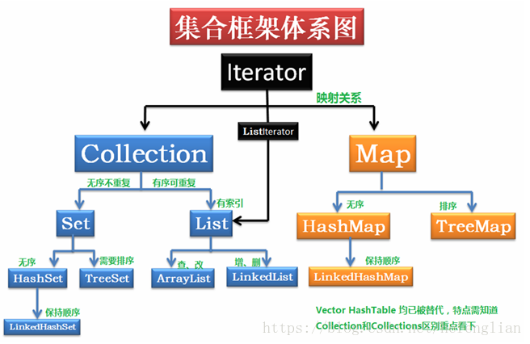

# day05

[TOC]

## Java集合类图

### Java集合框架图

> 图片来源链接：https://blog.csdn.net/hefenglian/article/details/82596453


### Java集合框架体系图

> 图片来源链接：https://blog.csdn.net/hefenglian/article/details/82596453



### Class diagram of Java Collections framework

> 国外小哥整理的，自己也不知对错，都放在这里，等深入学习后再回头来看。
>
> 图片来源：https://www.codejava.net/java-core/collections/overview-of-java-collections-framework-api-uml-diagram
>
> 摘录：
>
> The Java collections framework has a very complex API hierarchy.
> The following class diagram shows a brief overview of the Java Collections Framework which is divided into four groups: List, Set, Map and Queue. Only the principal, commonly-used interfaces and classes are listed.


## 集合

1. 会使用集合存储数据；
2. 会遍历集合，把数据取出来；
3. 掌握每种集合的特性。

* `Collection`接口

  ```
  定义的是所有单列集合中共性的方法，所以的单列集合都可以使用共性的方法
  ```
  * `List`接口

      ```
      1. 有序的集合(存储和取出元素顺序相同)
      2. 允许存储重复的元素
      3. 有索引，可以使用普通的`for循环`遍历
      ```

  	* `Vector`集合
  	* `ArrayList`集合
  	* `LinkedList`集合
  	
  * `Set`接口

      ```
      1.不允许存储重复元素
      2.没有索引(不能使用普通的for循环遍历)
      3.无序的集合(TreeSet/hashSet存储和取出元素的顺序有可能不一致)，LinkedHashSet是一个有序集合。
      ```
  	
  	* `TreeSet`集合
  	* `hashSet`集合
  		* `LinkedHashSet`集合

## 集合框架的学习方法

```
1. 学习顶层：是学习顶层接口/抽象类中共性的方法，所有的子类都可以使用；
2. 使用底层：底层不是接口就是抽象类，无法创建对象使用，需要使用底层的子类创建对象使用。
```

## Collection

> `Collection`是单列集合类的根接口，有两个重要的子接口：`java.util.List`和`java.util.Set`

* `Collection`
  * `java.util.List`
    * `java.util.ArrayList`
    * `java.util.LinkedList`
  * `java.util.Set`
    * `java.util.HashSet`
      * `java.util.LinkedHashSet`
    * `java.util.TreeSet`

### Collection常用功能

* `public boolean add(E e)`：给定元素的对象添加到当前的集合中；
* `public void clear()`：清空集合中所有的元素；
* `public boolean remove(E e)`：把给定的对象在当前集合中删除；
* `public boolean contains(E e)`：判断当前集合中是否包含给定的对象；
* `public boolean isEmpty()`：判断当前集合是否为空；
* `public int size()`：返回集合中元素的个数；
* `public Object[] toArray()`：把集合中的元素，存储到数组中。

## Iterator迭代器

### Iterator接口

> 在程序的开发中，需要经常遍历集合中的所有元素。所以JDK提供了一个接口`java.util.Iterator`，`Iterator`接口也是`java`集合中的一成员，但它与`Collection`、`Map`接口不同。`Collection`接口与`Map`接口主要用于存储元素，而`Iterator`主要用于迭代访问`Collection`中的元素，所以`Iterator`对象也被成为迭代器。
>
> `Iterator`是一个接口，所以无法实例化，需要通过`Collection`接口的方法`public Iterator iterator()`，返回一个迭代器的实现类对象。

* `public Iterator iterator()`：获取对应集合的迭代器，用来遍历集合中的元素。

### 迭代

> `Collection`集合元素的通用获取方式，在取元素之前先要判断集合中有没有元素，如果有，就把这个元素取出来，继续判断，如果还有元素则继续拿出来元素。直到把集合中的所有元素都取出来，这种方式成为迭代。

* `public E next();`：返回迭代器的下一个元素；
* `public boolean hasNext();`：判断是否有下一个元素。

### 迭代器使用步骤

1. 使用集合中的方法`iterator()`获取迭代器的实现类对象，使用`Iterator`接口接收(多态)；
2. 使用`Iterator`接口中的方法`hasNext()`判断是否有下一个元素；
3. 使用`Iterator`接口中的方法`next()`取出集合的下一个元素，元素作为返回值返回。

```java
package com_02.jianmo.Iterator;

import java.util.ArrayList;
import java.util.Collection;
import java.util.Iterator;

public class IteratorTest {
	public static void main(String[] args) {
		Collection<String> coll = new ArrayList<>();

		coll.add("李四"); coll.add("王五");
		coll.add("赵六"); coll.add("田七");

		Iterator<String> it = coll.iterator();  // 1.第一步，获取迭代器
		while (it.hasNext()) {  // 2.第二步，判断是否有下一个值
			System.out.println(it.next());  // 3.第三步，获取元素
		}
	}
}
```

### 迭代器实现原理

> `public Iterator iterator()`：方法返回的是指向`-1`位置的**指针**。
>
> `public E next();`：1、取出下一个元素，2、指针后移。如有没有元素则会抛出异常`NoSuchElementException`。
>
> `public boolean hasNext();`：判断是否有下一个元素。

## 增强for循环

> `JDK 1.5`之后出现的，专门用来遍历数组和集合的。内部实现是一个迭代器。

```java
for(元素的数据类型 变量:Collection集合或者数组) {
    // 变量
}
```

### 示例代码

```java
package com_02.jianmo.Iterator;

import java.util.ArrayList;
import java.util.Collection;
import java.util.Iterator;

public class IteratorTest {
	public static void main(String[] args) {
		Collection<String> coll = new ArrayList<>();

		coll.add("李四"); coll.add("王五");
		coll.add("赵六"); coll.add("田七");

		for (String i:coll) {
			System.out.println(i);
		}
	}
}
```

## 泛型

> 泛型是一种未知的数据类型，当我们不知道使用什么数据类型的时候，可以使用泛型，泛型也可以看做变量，用来接收数据类型。
>
> * `E e`：Element元素，`E`代表未知的数据类型。
> * `T t`：Type类型，`T`
>
> `ArrayList`集合在定义的时候不知道集合中都会存储什么类型的数据，所以类型使用泛型。
>
> ```java
> public class ArrayList<E> {
>     // ...
> }
> ```

### 泛型的优劣

* 不使用泛型
  * 好处：
    * 集合不使用泛型，默认的类型就是Object类型，可以存储任意类型的数据。
  * 弊端：
    * 不安全，会引发异常。
* 使用泛型
  * 好处：
    * 避免了类型转换的麻烦，存储的是什么类型，取出的就是什么类型；
    * 把运行期异常代码，提升到了编译期。
  * 弊端：
    * 泛型是什么类型，只能存储什么类型的数据。

```java
package com_03.jianmo.Generic;

import java.util.ArrayList;

public class GenericTest {
	public static void main(String[] args) {
//		show_01();  // 不使用泛型，会抛异常
		show_02();  // 使用泛型
	}

	// 集合不使用泛型
	private static void show_01() {
		ArrayList list = new ArrayList();
		list.add("aaa");
		list.add(10);

		for (Object it : list) {
			System.out.println(((String) it).length());  // java.lang.ClassCastException
		}
	}

	// 集合使用泛型
	private static void show_02() {
		ArrayList<String> list = new ArrayList<>();
		list.add("aaa");
		list.add("bbb");
		list.add("ccc");
		for (String it : list) {
			System.out.println(it);
		}
	}
}
```

### 泛型类的定义和使用

> 泛型类的定义：
>
> ```java
> 修饰符 class 类名<E> {
>     // ...
> }
> ```

#### 泛型类的定义

```java
package com_03.jianmo.Generic;

// 定义一个含有泛型的类
public class GenericClass<E> {
	public E getName() {
		return name;
	}

	public void setName(E name) {
		this.name = name;
	}

	private E name;

}
```

#### 泛型类的使用

```java
package com_03.jianmo.Generic;

public class GenericClassTest {
	public static void main(String[] args) {
		GenericClass<String> generic1 = new GenericClass<>();
		generic1.setName("aaa");
		System.out.println(generic1.getName());

		GenericClass<Integer> generic2 = new GenericClass<>();
		generic2.setName(111);
		System.out.println(generic2.getName());

	}
}
```

### 泛型方法的定义和使用

> 泛型定义在方法的修饰符合返回值类型之间，含有泛型的方法，在调用方法的时候确定泛型的数据类型，传递什么类型的参数，泛型就是什么类型。
> ````java
> 修饰符 <代表泛型的变量> 返回值类型 方法名(参数) {
>     // ...
> }
> ````

#### 泛型方法的定义

```java
package com_03.jianmo.Generic;

public class GenericFunction {
	public <E> void print(E e) {
		System.out.println(e);
	}
}
```

#### 泛型方法的使用

```java
package com_03.jianmo.Generic;

public class GenericFunctionTest {
	public static void main(String[] args) {
		GenericFunction func = new GenericFunction();
		func.print("aaa");  // 传递什么类型，泛型就是什么类型
		func.print(111);  // 传递什么类型，泛型就是什么类型
		func.print(2.22);  // 传递什么类型，泛型就是什么类型
	}
}
```

### 泛型接口的定义和使用

#### 泛型接口的定义

```java
package com_03.jianmo.Generic;

public interface GenericInterface<E> {
	public abstract void print(E e);
}
```

#### 泛型接口的实现一

```javascript
package com_03.jianmo.Generic;

// 实现一：使用泛型指定接口的类型
public class GenericInterfaceImpl_1<E> implements GenericInterface<E> {
	@Override
	public void print(E e) {
		System.out.println(e);
	}
}
```

#### 泛型接口的实现二

```java
package com_03.jianmo.Generic;

// 实现二：直接显式的指定接口的类型
public class GenericInterfaceImpl_2 implements GenericInterface<String> {
	@Override
	public void print(String s) {

	}
}
```

#### 泛型接口的使用

```java
package com_03.jianmo.Generic;

public class GenericInterfaceTest {
	public static void main(String[] args) {

		// public class GenericInterfaceImpl_1<E> implements GenericInterface<E>
		GenericInterfaceImpl_1<String> obj1 = new GenericInterfaceImpl_1<>();
		obj1.print("aaa");

		// public class GenericInterfaceImpl_2 implements GenericInterface<String>
		GenericInterfaceImpl_2 obj2 = new GenericInterfaceImpl_2();
		 obj2.print("bbb");
	}
}
```

### 泛型的通配符

> 使用泛型类或者接口时，传递的数据中，泛型类型不确定，可以通过通配符`<?>`表示，但是一旦使用泛型的通配符，只能使用`Object`类中的共性的方法，集合元素自身方法无法使用。`?`表示未知通配符，此时只能接受数据，不能往该集合中存储数据。

#### 使用方法

> `?`：代表任意的数据类型，且不能创建对象使用，最能作为方法的参数使用

