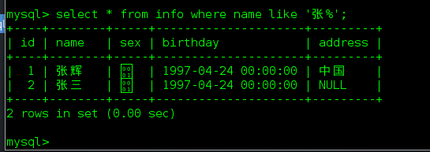
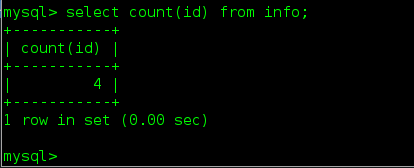
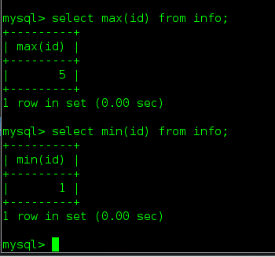
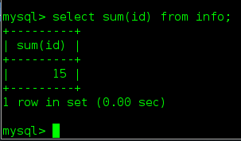
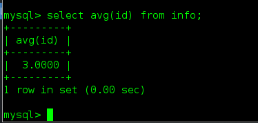

# 数据库查询

## 条件查询

### 基本的语法

> `select * from 表名;`

* `from`关键字后面写表名，表示数据来源于是这张表

* `select`后面写表中的列名，如果是`*`表示在结果中显示表中的所有列

* 在`select`后面的列名部分，可以使用`as`为列起别名，这个别名出现在结果集中

* 如果要查询多个列，之间使用逗号分隔

  

### 消除重复行

* 在`select`后面列前使用`distinct`可以消除重复的行

  > `select distinct 列名 from 表名;`

  * 单条件查询消除重复行

  

  * 多条件查询消除重复行

> 可见消除重复行是指所要查询的列的集合中所有信息都一样时才会消除。

### 条件

* 等于：=
* 大于：>
* 大于等于：>=
* 小于：<
* 小于等于：<=
* 不等于：!= 或 <>

### 逻辑运算符

* and：逻辑与
* or：逻辑或
* not：逻辑非

### 模糊查询

* `like`修饰词
* `%`表示任意多个任意字符
* `_`表示一个任意字符

### 范围查询

* `in`表示在一个非连续的范围内
* `between ... and ...`表示在一个连续的范围内

### 空判断

* `null`与`‘’`不同，一个表示空，一个表示空字符串
* 判空：`is null`

## 聚合的五个函数

> 为了快速得到统计数据，提供了5个聚合函数

1. `count(*)`函数

   > `count(*)`表示计算总行数，括号中写星与列名，结果是相同的。

   

2. `max(列)`函数

   > `max(列)`表示求此列的最大值。

3. `min(列)`

   > `min(列)`表示求此列的最小值。

   

   

4. `sum(列)`函数

   > `sum(列)`表示求此列的和	

   

5. `avg(列)`函数

   > `avg(列)`表示求此列的平均值，必须为数字 

   

## 分组

### 分组操作

> * 按照字段分组，表示此字段相同的数据会被放到一个组中
> * 分组后，只能查询出相同的数据列，对于有差异的数据列无法出现在结构集中
> * 可以对分组后的数据进行统计，做聚合运算

#### 语法

> `select 列1, 列2, 聚合... from 表名 group by 列1, 列2, 列3...;`

### 分组后进行筛选操作

#### 语法

>`select 列1, 列2, 聚合... from 表名 group by 列1,列2,列3... having 列1,... 聚合...`
>
>* `having`后面的条件运算符和`where`的相同

### where和having的区别

* `where`是对`from`后面指定的表进行数据筛选，属于对原始数据的筛选
* `having`是对`group by`的结果进行筛选

## 排序

### 语法

> `select * from 表名 order by 列1 asc|desc, 列2 asc|desc, ...`
>
> `asc`：从小到大排序，升序
>
> `desc`：从大到小排序，降序
>
> 不写默认为升序

## 分页

### 语法

> `select * from 表名 limit start,count`
>
> * 从`start`开始，获取`count`条数据
> * `start`索引从0开始

例：

## 总结

### 执行顺序

> * `from 表名`
> * `where ...`
> * group by ...
> * `select distinct *`
> * `having ...`
> * `order by ...`
> * `limit start, count`
