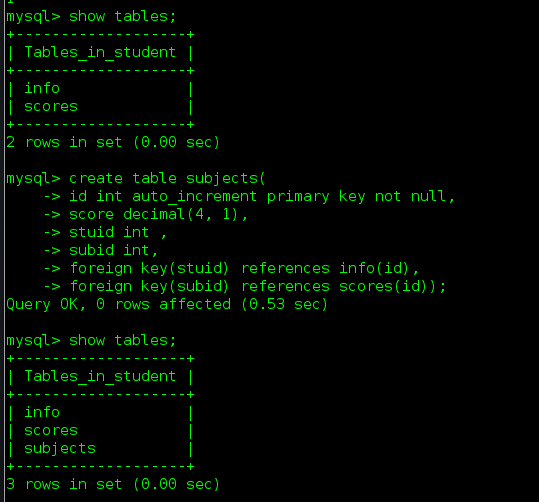
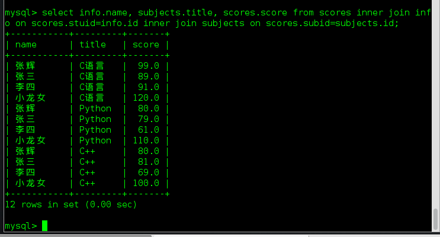

# 数据库高级操作

## 简介

* 实体与实体之间有3种关系，这些关系也需要存储下来
* 视图用于完成查询语句的封装
* 事物可以保证复杂的增删改操作有效性
* 当数据巨大时，为了提高查询速度可以通过索引实现

## 关系

> 先创建另一张表
>
> ```
> create table scores(
> id int primary key auto_increment,
> stuid int,
> subid int,
> score decimal(5,2));
> ```

### 建立关系

* 外键约束

  * 创建表的时候就添加外建

    > ```
    > create table scores(
    > id int primary key auto_increment,
    > stuid int,
    > subid int,
    > score decimal(5,2)
    > foreign key(当前表的字段) references 要引用的表(要引用的表的字段)
    > );
    > ```

    
  * 创建表之后再添加外键

    >```
    >alter table socres add constraint str_sco foreign key(stuid) references info(id)
    >```

    * 此时插入或者修改数据时，如果`stuid`的值在`info`表中不存在则会报错
    * 创建表时可以直接创建约束

    

* 外键的级联操作

  * 在删除`students`表的数据时，如果这个`id`值在`scores`中已经存在，则会跑出异常则会抛异常

  * 推荐使用逻辑删除，还可以解决这个问题

  * 可以创建表时指定级联操作，也可以在创建表后再修改外键的级联操作

    > 语法
    >
    > ```
    > alter table scores add constraint stu_sco foreign key(stuid) references student(id);
    > ```
    >

  * 级联操作的类型包括

    * `restrict(限制)`：默认值，抛异常
    * `cascade(级联)`：如果主表的记录删除，则从表中相关联的记录都将被删除
    * `set null`：将外键设置为空
    * `no action`：什么都不做

## 查询

### 连接查询

```
select students.name, subjects.title, scores.score
from scores
inner join students on scores.stuid=students.id
inner join subjects on scores.subid=subjects.id;
```



### 连接查询分类

* 表A `inner join` 表B：表A与表B匹配的行会出现在结果中
* 表A `left join`  表B：表A与表B匹配的行会出现在结构中，外加表A中独特的数据，未对应的数据使用`null`填充
* 表A `right join`  表B：表A与表B匹配的行会出现在结果中，外加表B中独有的数据，未对应的数据使用`null`填充


### 结论

> 当需要对有关系的多张表进行查询时，需要使用连接查询`join`。


