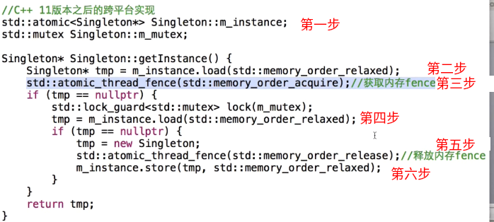

# 对象性能模式

[TOC]

* 面向对象很好地解决了"抽象"的问题，但是必不可免地要付出一定的代价。对于通常情况来讲，面向对象的成本大都可以忽略不计。但是某些情况，面向对象所带来的成本必须谨慎处理。
* 经典模式
  * Singleton
  * Flyweight

## 单件模式/单例模式

### 动机(Motivation)

* 在软件系统中，经常有这样一些特殊的类，必须保证它们在系统中只存在一个实例，才能保证它们的逻辑正确性、以及良好的效率。
* 如何绕过常规的构造器，提供一种机制来保证一个类只有一个实例？
* 这应该是类设计者的责任，而不是使用者的责任。

### 模式定义

> 保证一个类仅有一个实例，并提供一个该实例的全局访问点。

### 要点总结

* Singleton模式中的实例构造器可以设置为protected以允许子类派生。
* Singleton模式一般不要支持拷贝构造函数和Clone接口，因为这有可能导致多个对象实例，于Singleton模式的初衷违背。
* 如何实现多线程环境下安全的Singleton？注意对双检查索的正确实现。

##  享元模式

### 动机(Motivation)

* 在软件系统采用纯粹对象方案的问题在于大量细粒度的对象会很快充斥在系统中，从而带来很高的运行时代价－－主要指内存需求方面的代价。
* 如何在避免大量细粒度对象问题的同时，让外部客户程序仍然能够透明地使用面向对象的方式来进行操作？

### 模式定义

> 运用共享技术有效的支持大量细粒度的对象。

### 要点总结

* 面向对象很好地解决了抽象性的问题，但是作为一个运行在机器中的程序实体，我们需要考虑对象的代价问题。Flyweight抓哟解决面向对象的代价问题，一般不触及面向对象的抽象性问题。
* Flyweight采用对象共享的做法来降低系统中对象的个数，从而降低细粒度对象给系统带来的内存压力。在具体实现方面，要注意对象状态的处理。
* 对象的数量太大从而导致对象内存开销加大－－什么样的数量才算大？这需要我们仔细的根据具体应用情况进行评估，而不是凭空臆想。

## reorder

#### 参考链接

http://dreamrunner.org/blog/2014/06/28/qian-tan-memory-reordering/

https://www.cnblogs.com/zhao-zongsheng/archive/2018/05/26/9092520.html

https://zh.cppreference.com/w/cpp/atomic/memory_order

https://preshing.com/20120625/memory-ordering-at-compile-time/(最后一个是英文的没看。。。)

> 举个例子：假设使用new一个对象如，`people * p = new people;`若有三个部分，分配内存，给p赋值地址，调用构造函数。**一个合理顺序**是，分配内存，调用构造函数，赋值地址。但是如果编译器进行优化，产生了reorder重排序。如果变成了分配内存，赋值地址，调用构造，当还未调用构造函数对内存进行处理，此时如果有多线程程序，并且是单件/单例模式，使用了双检查锁机制，那么另一个线程得到的地址是一个未经过初始化的地址。使用会出现问题，即为内存读写reorder不安全。
>
> 单线程不会存在这个问题，但是多线程会存在reorder问题。
>
> win平台可以加volatile关键字，避免reorder，不跨平台告诉编译器不要优化。保证内存安全。
>
> C++11标准是使用`std::atomic`，堆上使用比较麻烦，如果是栈上，较为简单参考[链接](https://www.cnblogs.com/zhao-zongsheng/archive/2018/05/26/9092520.html)，链接最后部分，展示了使用。

